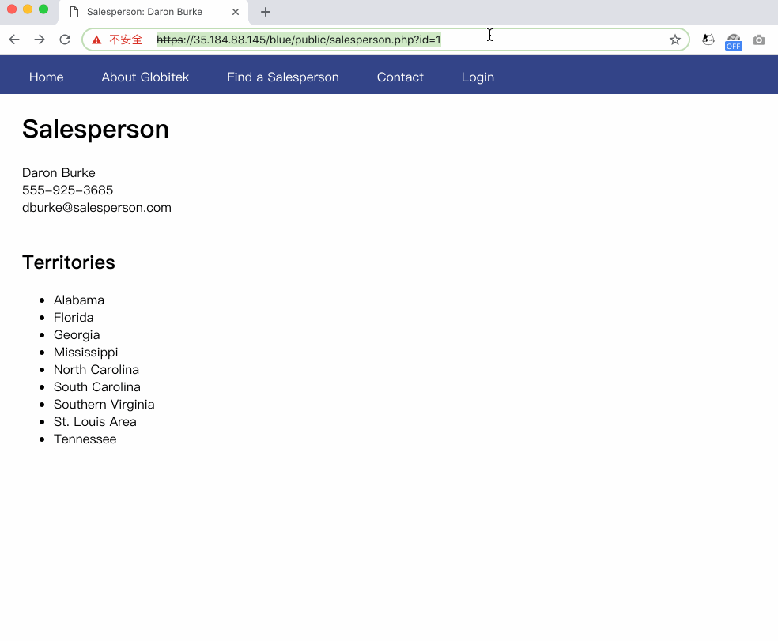
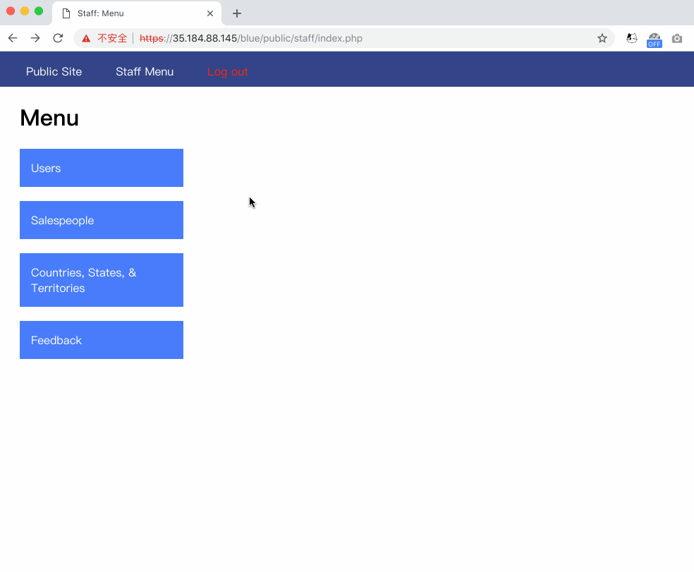
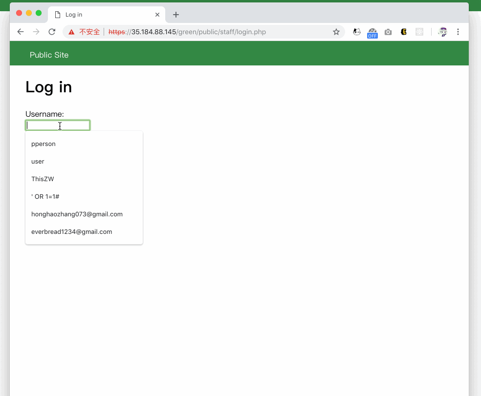
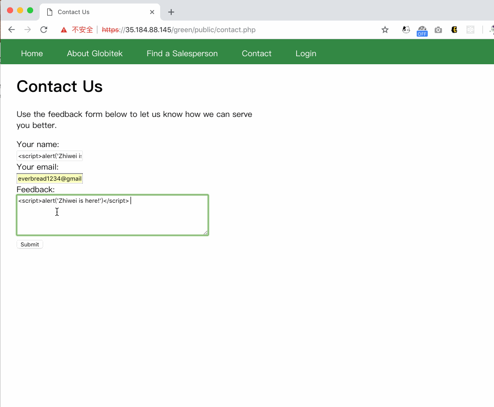
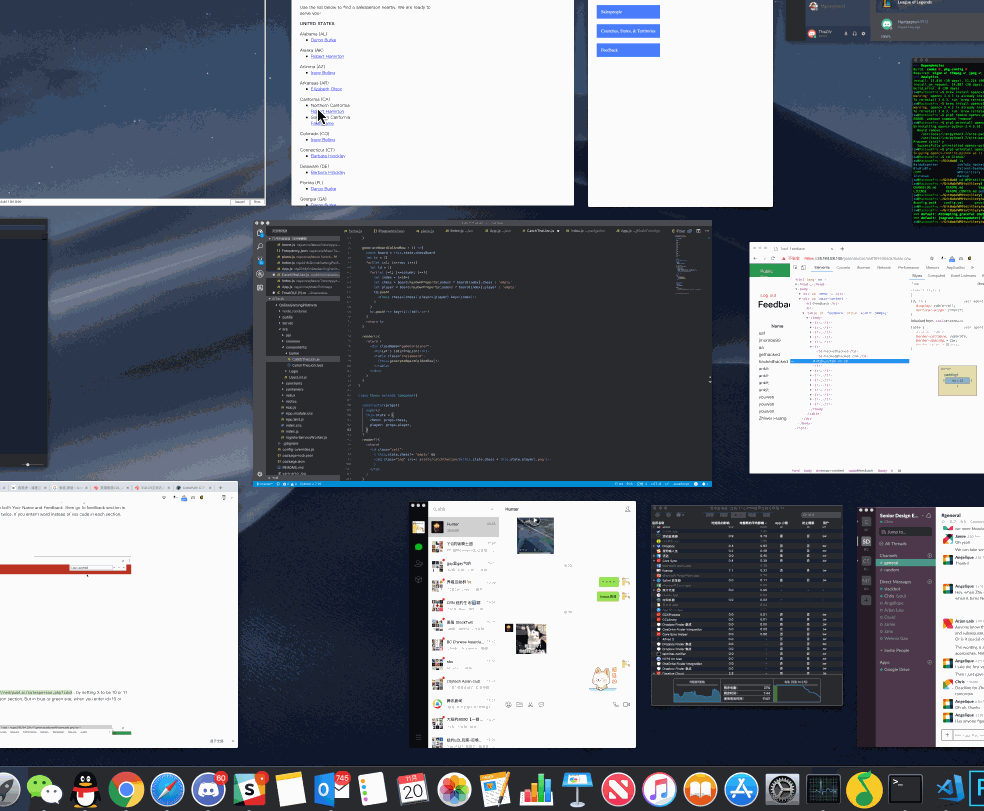
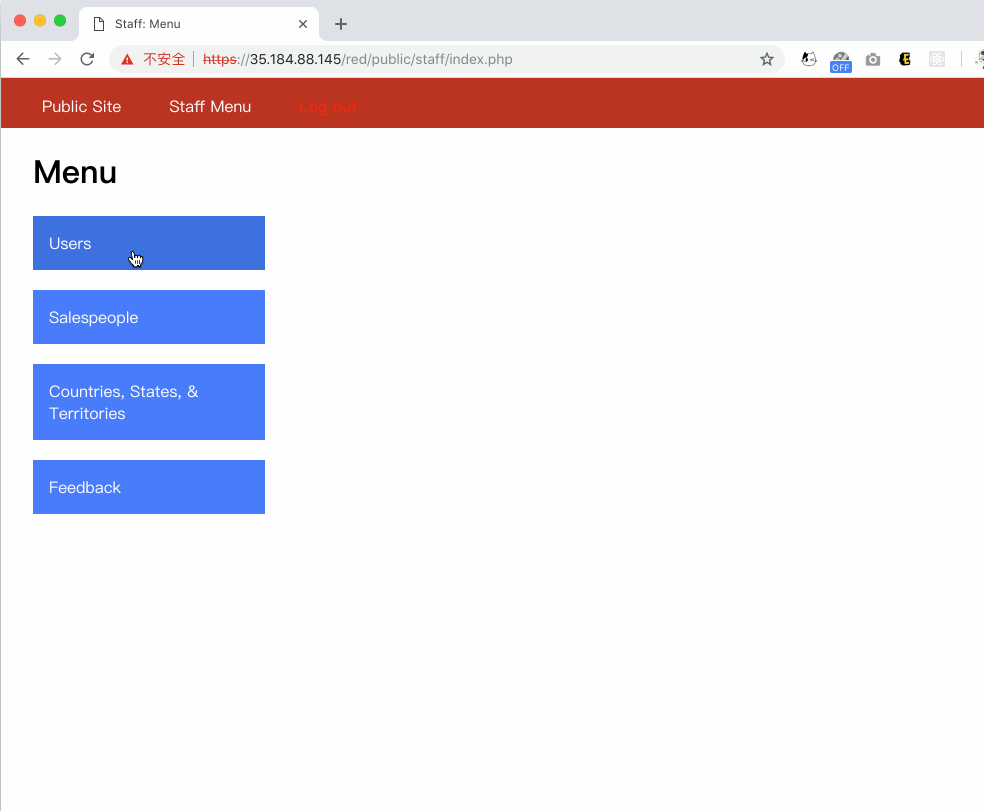

# Project 8 - Pentesting Live Targets

Time spent: **X** hours spent in total

> Objective: Identify vulnerabilities in three different versions of the Globitek website: blue, green, and red.

The six possible exploits are:
* Username Enumeration
* Insecure Direct Object Reference (IDOR)
* SQL Injection (SQLi)
* Cross-Site Scripting (XSS)
* Cross-Site Request Forgery (CSRF)
* Session Hijacking/Fixation

Each version of the site has been given two of the six vulnerabilities. (In other words, all six of the exploits should be assignable to one of the sites.)

## Blue

Vulnerability #1: SQL Injection: 
- [X] Summary: It seems like the salesperson page is vunlerable about SQLi that it will return database query failure if we change the id=x into the form if id=x'or1=1 or something else.
- [X] GIF: 
  -  

Vulnerability #2: Session Hijacking/Fixation
- [X] Summary: It is possible to catch session id from a browser with logged in account, copy the session and set it into another brower without logged account, then in that browser it will be automatically logged in.
- [X] GIF: 
  - 

## Green

Vulnerability #1: User Enumeration
- [X] Summary: The failure return of loggin in will be bold if the account exists, otherwise no.
- [X] GIF: 
  - 

Vulnerability #2: XSS
- [X] Summary: Adding JS script into Contact us page as name and details, then on the feedback page the js script will be triggered.
- [X] GIF: 
  -  

## Red

Vulnerability #1: Insecure direct object reference
- [X] Summary: In the Salesperson section with id=X, by setting X to be 10 or 11 will give two people that can't be found in Find a Salesperson section. This does not happen in blue and green as they will redirect to the initial page.
- [X] GIF: 
  - 

Vulnerability #2: Cross Site Request Fogery
- [X] Summary: The incorrect csrf token will not prevent the post to be processed.
- [X] GIF: 
  - 

## Notes

Describe any challenges encountered while doing the work

